# TPT AWS Infrastructure with CI/CD Pipeline


## Overview
This document visualizes the complete AWS infrastructure architecture for the TPT (Trading-PT) project, including the integrated CI/CD pipeline using GitHub Actions, AWS CodeDeploy, ECR, and other AWS services.

> 🚀 **Status**: Production Ready | 📊 **Users**: 100-500 concurrent | 👥 **Team**: 3 developers

## Table of Contents
- [Architecture Diagram](#architecture-diagram)
- [CI/CD Pipeline Flow](#cicd-pipeline-flow)
- [Key Components](#key-components)
- [Color Coding System](#color-coding-system)
- [Usage Notes](#usage-notes)

## Architecture Diagram

> **Note**: This diagram uses Mermaid syntax. If you're viewing this on GitHub, the diagram should render automatically. If not, you can copy the code below and paste it into any Mermaid editor like [Mermaid Live Editor](https://mermaid.live/).

```mermaid
flowchart TB
    %% External Users and Internet
    Users[👥 Users<br/>100-500명] --> Internet[🌐 Internet]
    DevTeam[👨‍💻 Dev Team<br/>개발자 3명] --> Internet
    
    %% CI/CD Pipeline - External Services
    subgraph CICD["🔄 CI/CD Pipeline"]
        GitHub[🐙 GitHub Repository<br/>Source Code<br/>develop branch]
        
        subgraph GitHubActions["⚙️ GitHub Actions Workflow"]
            GHBuild[🔨 Build Stage<br/>JDK 17 + Gradle<br/>JAR Generation]
            GHDocker[🐳 Docker Build<br/>Image Creation<br/>SHA Tag]
            GHUpload[📤 Upload Stage<br/>S3 + Parameter Store<br/>Deploy Package]
            GHDeploy[🚀 Deploy Trigger<br/>CodeDeploy Start]
        end
        
        GitHubSecrets[🔐 GitHub Secrets<br/>AWS Credentials<br/>Access Keys]
    end
    
    %% AWS Cloud boundary
    subgraph AWS["☁️ AWS Cloud (ap-northeast-2a)"]
        %% CI/CD AWS Services
        subgraph CICDServices["🛠️ CI/CD Services"]
            ECR[📦 ECR Repository<br/>tpt/dev-server<br/>Docker Images]
            CodeDeploy[🚀 CodeDeploy<br/>Application: tpt-server<br/>Group: Develop]
            ParameterStore[⚙️ Parameter Store<br/>/dev/ecr/registry<br/>/dev/ecr/repository<br/>/dev/image/tag]
            S3Deploy[🪣 S3 Deployment<br/>tpt-dev-server<br/>deploy-SHA.zip]
        end
        
        %% VPC
        subgraph VPC["🏢 VPC (10.0.0.0/16)"]
            %% Internet Gateway
            IGW[🌐 Internet Gateway]
            
            %% Public Subnet
            subgraph PublicSubnet["🌍 Public Subnet (10.0.1.0/24)"]
                ALB[⚖️ Application<br/>Load Balancer<br/>Port: 80, 443]
                Bastion[🛡️ Bastion Host<br/>t3.nano<br/>SSH: 22]
                NAT[🚪 NAT Gateway<br/>Outbound Only]
            end
            
            %% Private Dev Subnet
            subgraph PrivateDevSubnet["🧪 Private Dev Subnet (10.0.10.0/24)"]
                subgraph DevEC2["💻 Dev Server (t3.small)"]
                    subgraph DevDocker["🐳 Docker Compose"]
                        DevApp[📱 Spring Boot<br/>Port: 8080]
                        DevDB[🗄️ PostgreSQL<br/>Port: 5432<br/>Dev Data]
                        DevRedis[📦 Redis<br/>Port: 6379<br/>Dev Cache]
                    end
                    DevAgent[📊 CloudWatch<br/>Agent]
                    
                    %% Deployment Scripts
                    subgraph DeployScripts["📜 Deployment Scripts"]
                        StopScript[🛑 stop-containers.sh<br/>BeforeInstall]
                        LoadEnvScript[⚙️ load-env.sh<br/>AfterInstall]
                        StartScript[▶️ start-app.sh<br/>ApplicationStart]
                        ValidateScript[✅ validate.sh<br/>ValidateService]
                    end
                end
            end
            
            %% Private Prod Subnet  
            subgraph PrivateProdSubnet["🏭 Private Prod Subnet (10.0.20.0/24)"]
                subgraph ProdEC2["🖥️ Prod Server (t3.medium)"]
                    subgraph ProdDocker["🐳 Docker Compose"]
                        ProdApp[📱 Spring Boot<br/>Port: 8080]
                        ProdDB[🗄️ PostgreSQL<br/>Port: 5432<br/>Prod Data]
                        ProdRedis[📦 Redis<br/>Port: 6379<br/>Prod Cache]
                    end
                    ProdAgent[📊 CloudWatch<br/>Agent]
                end
            end
        end
        
        %% EBS Volumes
        DevEBS[💾 Dev EBS<br/>50GB gp3]
        ProdEBS[💾 Prod EBS<br/>100GB gp3]
        
        %% S3 Bucket
        S3[🪣 S3 Bucket<br/>App Assets<br/>& Backups]
        
        %% CloudWatch Services
        subgraph CloudWatch["📈 CloudWatch"]
            CWLogs[📋 CloudWatch Logs<br/>- App Logs<br/>- System Logs<br/>- Container Logs<br/>- Deployment Logs]
            CWMetrics[📊 CloudWatch Metrics<br/>- CPU/Memory<br/>- Network I/O<br/>- Custom Metrics<br/>- Deployment Metrics]
            CWAlarms[🚨 CloudWatch Alarms<br/>- Resource Usage<br/>- Error Rates<br/>- Response Time<br/>- Deployment Failures]
        end
        
        %% SNS for Alerts
        SNS[📧 SNS Topic<br/>Alert Notifications<br/>Deployment Status]
        
        %% IAM Roles
        subgraph IAMRoles["🔐 IAM Roles"]
            EC2Role[🖥️ EC2 Instance Profile<br/>- CloudWatch Permissions<br/>- S3 Access<br/>- ECR Pull<br/>- Parameter Store Read]
            CodeDeployRole[🚀 CodeDeploy Service Role<br/>- EC2 Access<br/>- Auto Scaling<br/>- Load Balancer]
            GitHubOIDC[🔑 GitHub OIDC Provider<br/>- ECR Push<br/>- Parameter Store Write<br/>- S3 Upload<br/>- CodeDeploy Trigger]
        end
    end
    
    %% External Services
    Slack[💬 Slack<br/>Alert Notifications<br/>Deployment Status]
    
    %% CI/CD Pipeline Flow
    DevTeam -->|1. Code Push| GitHub
    GitHub -->|2. Trigger| GitHubActions
    GitHubActions -->|3. Build| GHBuild
    GHBuild -->|4. Docker Build| GHDocker
    GHDocker -->|5. Push Image| ECR
    GitHubActions -->|6. Update Config| ParameterStore
    GHUpload -->|7. Upload Package| S3Deploy
    GHDeploy -->|8. Trigger Deploy| CodeDeploy
    
    %% AWS Authentication
    GitHubActions -.->|OIDC Auth| GitHubOIDC
    GitHubSecrets -.->|AWS Credentials| GitHubActions
    
    %% Deployment Flow
    CodeDeploy -->|9. Download Package| S3Deploy
    CodeDeploy -->|10. Execute Scripts| DeployScripts
    StopScript -->|11. Stop Containers| DevDocker
    LoadEnvScript -->|12. Load Config| ParameterStore
    StartScript -->|13. Pull & Start| ECR
    StartScript -->|14. Start Containers| DevDocker
    ValidateScript -->|15. Health Check| DevApp
    
    %% Network Connections
    Internet --> IGW
    IGW --> ALB
    IGW --> Bastion
    
    %% User Traffic Flow
    ALB --> ProdApp
    
    %% Developer Access Flow
    Bastion -.SSH Tunnel.-> DevEC2
    Bastion -.SSH Tunnel.-> ProdEC2
    
    %% Internal Network Flow
    DevEC2 --> NAT
    ProdEC2 --> NAT
    NAT --> IGW
    
    %% Data Storage
    DevEC2 -.Persistent Storage.-> DevEBS
    ProdEC2 -.Persistent Storage.-> ProdEBS
    DevEC2 -.Backup.-> S3
    ProdEC2 -.Backup.-> S3
    
    %% Monitoring Flow
    DevAgent --> CWLogs
    DevAgent --> CWMetrics
    ProdAgent --> CWLogs
    ProdAgent --> CWMetrics
    CodeDeploy --> CWLogs
    GitHubActions --> CWMetrics
    
    CWMetrics --> CWAlarms
    CWAlarms --> SNS
    SNS --> Slack
    
    %% Docker Internal Connections
    DevApp -.-> DevDB
    DevApp -.-> DevRedis
    ProdApp -.-> ProdDB
    ProdApp -.-> ProdRedis
    
    %% IAM Permissions
    DevEC2 -.->|Uses| EC2Role
    ProdEC2 -.->|Uses| EC2Role
    CodeDeploy -.->|Uses| CodeDeployRole
    
    %% Security Groups (represented as styling)
    classDef publicSubnet fill:#e1f5fe,stroke:#01579b,stroke-width:2px
    classDef privateSubnet fill:#f3e5f5,stroke:#4a148c,stroke-width:2px
    classDef database fill:#fff3e0,stroke:#e65100,stroke-width:2px
    classDef monitoring fill:#e8f5e8,stroke:#2e7d32,stroke-width:2px
    classDef security fill:#ffebee,stroke:#c62828,stroke-width:2px
    classDef cicd fill:#fff8e1,stroke:#f57f17,stroke-width:3px
    classDef cicdflow fill:#e3f2fd,stroke:#1565c0,stroke-width:2px
    
    class PublicSubnet,ALB,Bastion,NAT publicSubnet
    class PrivateDevSubnet,PrivateProdSubnet,DevEC2,ProdEC2 privateSubnet
    class DevDB,DevRedis,ProdDB,ProdRedis,DevEBS,ProdEBS,S3 database
    class CloudWatch,CWLogs,CWMetrics,CWAlarms,DevAgent,ProdAgent monitoring
    class IAMRoles,EC2Role,CodeDeployRole,GitHubOIDC,Bastion security
    class CICD,GitHub,GitHubActions,GitHubSecrets,CICDServices,ECR,CodeDeploy,ParameterStore,S3Deploy cicd
    class GHBuild,GHDocker,GHUpload,GHDeploy,DeployScripts,StopScript,LoadEnvScript,StartScript,ValidateScript cicdflow
```

<details>
<summary>Click to view the full architecture diagram</summary>



</details>

## Quick Reference

### 🚀 Technology Stack
- **Backend**: Spring Boot 3.5.3 + Kotlin 1.9.25
- **Database**: PostgreSQL + Redis
- **Infrastructure**: AWS (VPC, EC2, ALB, EBS)
- **CI/CD**: GitHub Actions + AWS CodeDeploy + ECR
- **Monitoring**: CloudWatch + SNS + Slack

### 📊 Environment Overview
- **Users**: 100-500 concurrent users
- **Team**: 3 developers
- **Environments**: Development + Production
- **Deployment**: Automated via develop branch

### 🔧 Simplified Architecture View

```
┌─────────────────┐    ┌─────────────────┐    ┌─────────────────┐
│   GitHub Repo   │───▶│ GitHub Actions  │───▶│   AWS ECR      │
│  (develop)      │    │  (Build & Test) │    │ (Docker Images) │
└─────────────────┘    └─────────────────┘    └─────────────────┘
                                │                       │
                                ▼                       ▼
┌─────────────────┐    ┌─────────────────┐    ┌─────────────────┐
│   Parameter     │◀───│   CodeDeploy    │───▶│   Dev Server    │
│     Store       │    │   (Automated)   │    │   (Docker)      │
└─────────────────┘    └─────────────────┘    └─────────────────┘
                                │                       │
                                ▼                       ▼
┌─────────────────┐    ┌─────────────────┐    ┌─────────────────┐
│   S3 Bucket     │    │   CloudWatch    │    │   PostgreSQL    │
│  (Artifacts)    │    │  (Monitoring)   │    │   & Redis       │
└─────────────────┘    └─────────────────┘    └─────────────────┘
```

## CI/CD Pipeline Flow

### 🔄 Complete Deployment Process (15 Steps)

1. **Code Push** → Developer pushes code to GitHub develop branch
2. **Trigger** → GitHub Actions workflow automatically triggered
3. **Build** → JDK 17 setup, Gradle build, JAR generation
4. **Docker Build** → Docker image creation with SHA-based tagging
5. **Push Image** → Docker image pushed to ECR repository
6. **Update Config** → Parameter Store updated with new image tags
7. **Upload Package** → Deployment package uploaded to S3
8. **Trigger Deploy** → CodeDeploy deployment initiated
9. **Download Package** → CodeDeploy downloads deployment package from S3
10. **Execute Scripts** → Deployment scripts execution begins
11. **Stop Containers** → `stop-containers.sh` stops existing containers
12. **Load Config** → `load-env.sh` loads environment variables from Parameter Store
13. **Pull & Start** → `start-app.sh` pulls new image from ECR
14. **Start Containers** → New containers started with updated image
15. **Health Check** → `validate.sh` performs application health verification

## Key Components

### 🛠️ CI/CD Services

- **GitHub Repository**: Source code management with develop branch triggering
- **GitHub Actions**: Automated build, test, and deployment workflows
- **ECR Repository**: `tpt/dev-server` for Docker image storage
- **CodeDeploy**: Application deployment with `tpt-server` application and `Develop` group
- **Parameter Store**: Environment configuration management (`/dev/ecr/*` parameters)
- **S3 Deployment**: Deployment artifacts storage (`tpt-dev-server` bucket with `deploy-SHA.zip` files)

### 🔐 Security & Permissions

- **GitHub OIDC Provider**: Secure authentication for GitHub Actions
- **EC2 Instance Profile**: CloudWatch, S3, ECR, and Parameter Store access
- **CodeDeploy Service Role**: EC2 and Auto Scaling permissions
- **IAM Roles**: Principle of least privilege access control

### 📊 Monitoring & Logging

- **CloudWatch Integration**: Application, system, container, and deployment logs
- **Custom Metrics**: CPU, memory, network I/O, and deployment metrics
- **Alerting**: SNS notifications for deployment status and system health
- **Slack Integration**: Real-time notifications for development team

### 🏗️ Infrastructure Components

- **VPC**: Isolated network environment (10.0.0.0/16)
- **Public Subnet**: Load balancer, bastion host, and NAT gateway
- **Private Dev Subnet**: Development server with Docker Compose stack
- **Private Prod Subnet**: Production server with Docker Compose stack
- **EBS Volumes**: Persistent storage for both environments
- **Application Load Balancer**: Traffic distribution and SSL termination

## Color Coding System

- **🟡 CI/CD Pipeline**: Main CI/CD components and services
- **🔵 CI/CD Flow**: Deployment scripts and workflow stages
- **🟣 Private Subnet**: Private subnet resources and components
- **🔵 Public Subnet**: Public subnet resources and components
- **🟠 Database**: Database and storage components
- **🟢 Monitoring**: Monitoring and logging services
- **🔴 Security**: Security and permission management

## Usage Notes

- This architecture supports automatic deployment triggered by pushes to the develop branch
- The system provides comprehensive monitoring and alerting for both infrastructure and application health
- Security is implemented through IAM roles following the principle of least privilege
- The deployment process includes health checks and rollback capabilities
- All deployment activities are logged and monitored through CloudWatch

## 🔧 Troubleshooting

For deployment issues and troubleshooting guidance, refer to the [CLAUDE.md](./CLAUDE.md#deployment-troubleshooting) file which contains:

- **CodeDeploy Script Issues**: Common script-related deployment failures
- **Parameter Store Access**: Configuration and permissions troubleshooting
- **Health Check Failures**: Application startup and connectivity issues
- **Quick Diagnosis Commands**: Useful commands for debugging deployments

### Quick Links
- [Deployment Troubleshooting Guide](./CLAUDE.md#deployment-troubleshooting)
- [Common Development Commands](./CLAUDE.md#common-development-commands)
- [CI/CD Pipeline Configuration](./CLAUDE.md#cicd-pipeline)

## 📚 Related Documentation

- [GitHub Actions Workflow](./.github/workflows/deploy-dev.yml)
- [CodeDeploy Configuration](./appspec.yml)
- [Docker Compose Dev](./docker-compose-dev.yml)
- [Deployment Scripts](./scripts/)

---

<div align="center">

**TPT (Trading-PT) Project**  
*Spring Boot + Kotlin + PostgreSQL + Redis*

Made with ❤️ by the TPT Development Team

</div>