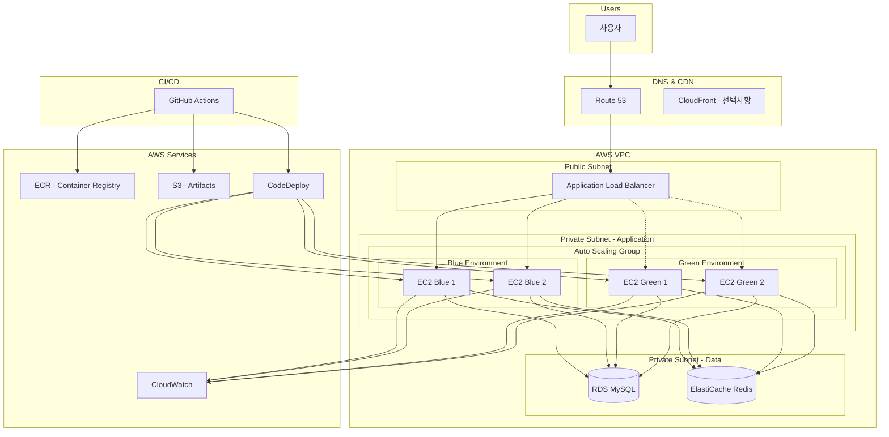
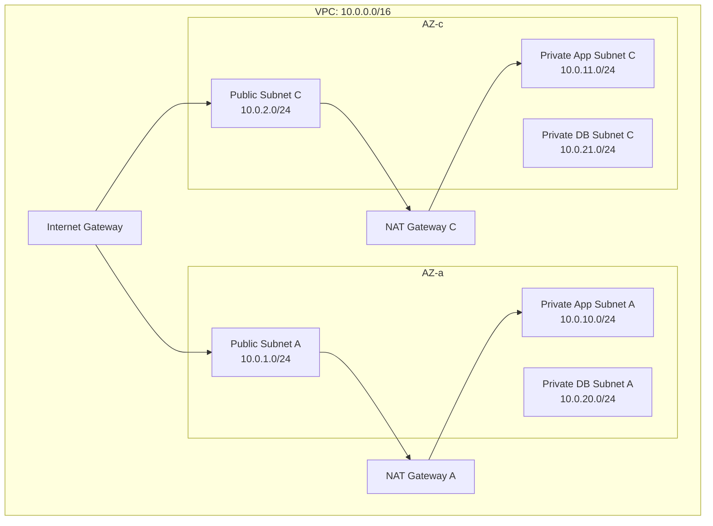
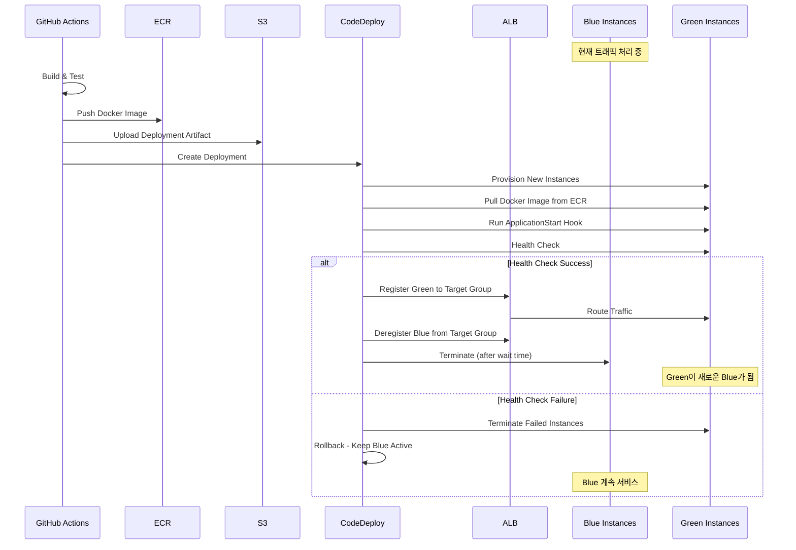

# 운영 환경 인프라 구축 및 Blue/Green 무중단 배포 시스템

> **Version**: 1.1.0
> **Last Updated**: 2025-11-27
> **Author**: TradingPT DevOps Team

---

## 📌 기술 키워드 (Technical Keywords)

| 카테고리 | 키워드 |
|---------|--------|
| **기능 유형** | `Infrastructure`, `Platform`, `CI/CD`, `DevOps` |
| **아키텍처** | `AWS`, `Blue/Green Deployment`, `Auto Scaling`, `High Availability` |
| **기술 스택** | `AWS EC2 t3.medium`, `RDS db.t4g.medium`, `ElastiCache cache.t4g.micro`, `ALB`, `ASG`, `CodeDeploy`, `ECR`, `S3`, `GitHub Actions` |
| **설계 패턴** | `Blue/Green`, `Immutable Infrastructure`, `Health Check Pattern`, `GitOps` |
| **품질 속성** | `Scalability`, `Reliability`, `Cost-Efficiency`, `Zero-Downtime` |
| **개발 방법론** | `GitOps`, `CI/CD`, `Infrastructure as Code`, `DevSecOps` |

---

> **작성일**: 2025년 11월
> **프로젝트**: TradingPT API 운영 인프라
> **도메인**: Cloud Infrastructure, DevOps, CI/CD
> **개발 기간**: 2025년 11월 (약 2주)
> **예상 월 비용**: ~$242/월 (K8s 대비 연간 $1,332 절감)

## 목차

1. [프로젝트 배경](#1-프로젝트-배경)
2. [요구사항 분석](#2-요구사항-분석)
3. [기술적 도전 과제](#3-기술적-도전-과제)
4. [아키텍처 설계](#4-아키텍처-설계)
5. [핵심 구현](#5-핵심-구현)
6. [품질 보장](#6-품질-보장)
7. [성과 및 임팩트](#7-성과-및-임팩트)
8. [테스트 검증 결과](#8-테스트-검증-결과)
9. [면접 Q&A](#9-면접-qa)

---

## 1. 프로젝트 배경

### 비즈니스 니즈

- **배경**: TradingPT 서비스의 본격적인 운영 환경 구축 필요. 개발 환경에서 검증된 API를 안정적으로 운영 환경에서 서비스해야 하는 시점 도래
- **목표**: 500-1000명의 초기 사용자를 안정적으로 서비스할 수 있는 확장 가능한 인프라 구축 및 서비스 중단 없는 배포 시스템 확립
- **기대 효과**:
  - 무중단 배포로 사용자 경험 향상
  - 자동 스케일링으로 트래픽 변동 대응
  - 비용 효율적인 인프라 운영

### 기술 환경

- **기술 스택**: Spring Boot 3.5.5, Java 17, MySQL 8.0, Redis
- **인프라**: AWS (EC2, RDS, ElastiCache, ALB, ASG, CodeDeploy, ECR, S3)
- **CI/CD**: GitHub Actions, AWS CodeDeploy
- **컨테이너**: Docker

### 왜 무중단 배포가 필요한가?

1. **사용자 경험**: 배포 시 서비스 중단은 사용자 이탈로 직결
2. **비즈니스 연속성**: 트레이딩 플랫폼 특성상 24시간 가용성 필수
3. **빠른 피드백**: 잦은 배포로 빠른 기능 개선 및 버그 수정
4. **안전한 롤백**: 문제 발생 시 즉시 이전 버전으로 복귀 가능

---

## 2. 요구사항 분석

### 기능 요구사항 (Functional Requirements)

**FR-1**: 자동 스케일링
- **설명**: 트래픽 변동에 따른 EC2 인스턴스 자동 증감
- **우선순위**: Critical
- **수용 기준**: CPU 사용률 70% 초과 시 Scale-Out, 30% 미만 시 Scale-In

**FR-2**: 무중단 배포
- **설명**: Blue/Green 배포 방식을 통한 제로 다운타임 배포
- **우선순위**: Critical
- **수용 기준**: 배포 중 기존 트래픽 100% 유지, 롤백 시간 5분 이내

**FR-3**: 자동화된 헬스체크
- **설명**: 애플리케이션 상태 자동 모니터링 및 비정상 인스턴스 교체
- **우선순위**: High
- **수용 기준**: 30초 이내 비정상 인스턴스 감지 및 트래픽 차단

**FR-4**: CI/CD 파이프라인
- **설명**: GitHub Push 시 자동 빌드, 테스트, 배포
- **우선순위**: High
- **수용 기준**: main 브랜치 푸시 후 15분 이내 운영 환경 반영

### 비기능 요구사항 (Non-Functional Requirements)

| 항목 | 요구사항 | 목표 수치 |
|------|----------|-----------|
| **가용성** | 서비스 가동률 | 99.9% (연간 8.76시간 이내 다운타임) |
| **확장성** | 동시 사용자 지원 | 500-1000 CCU 초기, 5000+ 확장 가능 |
| **성능** | API 응답 시간 | < 200ms (P95) |
| **비용 효율성** | 인프라 비용 최적화 | 월 예상 비용 내 운영 |
| **복구 시간** | 장애 복구 목표 시간 | RTO < 5분, RPO < 1분 |
| **배포 속도** | 전체 배포 소요 시간 | < 15분 |

### 제약 사항 (Constraints)

- **기술적 제약**:
  - AWS 서비스 사용 (기존 개발 환경과 일관성)
  - Docker 컨테이너 기반 배포
  - Spring Boot Actuator 헬스체크 활용
- **비즈니스 제약**:
  - 초기 비용 최소화 (스타트업 환경)
  - 1인 DevOps로 운영 가능한 수준의 복잡도
- **리소스 제약**:
  - Kubernetes 도입은 향후 고려 (현재는 과도한 복잡성)

---

## 3. 기술적 도전 과제

### 주요 도전 과제

**도전 1**: Kubernetes vs Auto Scaling Group 선택
- **문제**: 컨테이너 오케스트레이션 방식 결정 필요
- **원인**: K8s는 강력하지만 초기 스타트업에게는 운영 오버헤드가 큼
- **해결 방향**: ASG + CodeDeploy Blue/Green으로 K8s 수준의 무중단 배포 구현

**도전 2**: Blue/Green 배포 시 AllowTraffic 단계 무한 대기 (Stuck)
- **문제**: 새 인스턴스(Green)가 정상임에도 CodeDeploy AllowTraffic 단계에서 무한 대기
- **원인**: **Target Group 설정 오류** - 배포 그룹에 Blue TG와 Green TG 2개를 설정했으나, Blue/Green 배포는 단일 Target Group만 사용해야 함
- **해결 방법**:
  1. CodeDeploy 배포 그룹 설정에서 Target Group을 1개만 지정
  2. Green TG 제거하고 Blue TG(`tpt-prod-api-tg`)만 사용하도록 수정
  3. CodeDeploy가 자동으로 Blue→Green 인스턴스 전환 관리
- **핵심 교훈**: Blue/Green 배포에서 2개의 Target Group은 사용자가 관리하는 것이 아니라 CodeDeploy가 내부적으로 관리함

**도전 3**: ASG 인스턴스 플래핑(Flapping) 현상 - 최초 배포 실패의 핵심 원인
- **문제**: 인스턴스가 반복적으로 Healthy/Unhealthy 상태 전환, 최초 Blue/Green 배포 연속 실패
- **원인**:
  - ASG Health Check Type을 `ELB`로 설정
  - JVM 애플리케이션 워밍업 시간(30-60초) 동안 Target Group Health Check 실패
  - ASG가 Unhealthy로 판단하여 인스턴스 종료 → 새 인스턴스 시작 → 반복
- **해결 방법**:
  1. ASG Health Check Type을 `EC2`로 변경 (인스턴스 상태만 확인)
  2. Health Check Grace Period를 `300초`로 설정
  3. Target Group에서만 애플리케이션 레벨 Health Check 수행 (역할 분리)
- **핵심 교훈**: ASG와 Target Group의 Health Check 역할을 명확히 분리해야 함

**도전 4**: CodeDeploy Lifecycle Hook으로 인한 인스턴스 `Pending:Wait` 상태
- **문제**: ASG 스케일아웃 시 새 인스턴스가 `Pending:Wait` 상태에서 5분간 대기
- **원인**: Blue/Green 배포 그룹 생성 시 CodeDeploy가 자동으로 Lifecycle Hook 추가 (`CodeDeploy_tpt-prod-server-asg_d-xxx`)
- **동작 방식**:
  1. ASG가 새 인스턴스 시작
  2. Lifecycle Hook이 인스턴스를 `Pending:Wait` 상태로 유지
  3. CodeDeploy 배포가 완료되어야 `InService`로 전환
  4. 단순 스케일아웃(배포 없이)의 경우 Hook Timeout(기본 1시간) 대기 후 전환
- **해결 방법**:
  - 정상 동작임을 이해하고 대기 (배포 시에는 자동 해제)
  - 즉시 해제 필요 시: `aws autoscaling complete-lifecycle-action` 명령 사용
- **핵심 교훈**: Blue/Green 배포 설정 시 Lifecycle Hook의 존재와 동작 방식을 이해해야 함

**도전 5**: Blue/Green 배포 후 원본 ASG 삭제 현상
- **문제**: 첫 Blue/Green 배포 성공 후 원래 ASG(`tpt-prod-server-asg`)가 사라짐
- **원인**: **정상 동작** - Blue/Green 배포는 새로운 ASG(`CodeDeploy_Production-BlueGreen_d-xxx`)를 생성하고 원본 ASG의 인스턴스를 종료
- **해결 방법**:
  1. 새로 생성된 CodeDeploy 관리 ASG에 원하는 설정 적용
  2. Health Check Type: EC2, Grace Period: 300초
  3. Desired: 2, Min: 2, Max: 4
- **핵심 교훈**: Blue/Green 배포에서 ASG 생명주기는 CodeDeploy가 관리함

### 기술적 트레이드오프

| 선택지 A | vs | 선택지 B | 최종 선택 | 이유 |
|---------|-------|----------|-----------|------|
| Kubernetes (EKS) | vs | ASG + CodeDeploy | **ASG + CodeDeploy** | 초기 비용/복잡도 최소화, 연간 $1,332 절감 |
| Rolling Update | vs | Blue/Green | **Blue/Green** | 즉시 롤백 가능, 더 안전한 배포 |
| EC2 Health Check | vs | ELB Health Check (ASG) | **EC2 Health Check** | 플래핑 방지, Target Group에서 트래픽 제어 |
| In-place 배포 | vs | Immutable 배포 | **Immutable** | 깨끗한 환경, 예측 가능한 배포 |
| t3.small 2대 | vs | t3.medium 2대 | **t3.medium** | 메모리 4GB로 JVM + Docker 안정 운영 |
| RDS db.t3.micro | vs | RDS db.t4g.medium | **db.t4g.medium** | ARM 기반 비용 효율, 2 vCPU/4GB로 안정성 확보 |

---

## 4. 아키텍처 설계

### 실제 AWS 인프라 구성 (Production)

#### 컴퓨팅 리소스
| 리소스 | 스펙 | 수량 | 용도 | 월 비용 |
|--------|------|------|------|---------|
| **EC2** | t3.medium (2 vCPU, 4GB) | 2대 | Spring Boot API 서버 | ~$60 |
| **RDS** | db.t4g.medium (2 vCPU, 4GB) | 1대 | MySQL 8.0 데이터베이스 | ~$58 |
| **ElastiCache** | cache.t4g.micro (2 vCPU, 0.5GB) | 1대 | Redis 세션/캐시 | ~$12 |
| **ALB** | Application Load Balancer | 1대 | 로드밸런싱, SSL 종료 | ~$22 |
| **NAT Gateway** | - | 1대 | Private 서브넷 아웃바운드 | ~$45 |
| **기타** | S3, ECR, CloudWatch 등 | - | 스토리지, 로그 | ~$45 |
| **합계** | - | - | - | **~$242/월** |

#### 네트워크 구성
| 구성요소 | CIDR/설정 | 용도 |
|----------|-----------|------|
| **VPC** | `10.0.0.0/16` | 메인 VPC |
| **Public Subnet A** | `10.0.1.0/24` (ap-northeast-2a) | ALB, NAT Gateway |
| **Public Subnet C** | `10.0.2.0/24` (ap-northeast-2c) | ALB (Multi-AZ) |
| **Private App Subnet A** | `10.0.10.0/24` | EC2 인스턴스 |
| **Private App Subnet C** | `10.0.11.0/24` | EC2 인스턴스 |
| **Private DB Subnet A** | `10.0.20.0/24` | RDS, ElastiCache |
| **Private DB Subnet C** | `10.0.21.0/24` | RDS (Multi-AZ 대비) |

#### CI/CD 리소스
| 리소스 | 이름 | 용도 |
|--------|------|------|
| **ECR Repository** | `tpt-server-prod` | Docker 이미지 저장소 |
| **S3 Bucket** | `tpt-prod-deployments` | 배포 아티팩트 저장 |
| **CodeDeploy App** | `tpt-server-prod` | 배포 애플리케이션 |
| **Deployment Group** | `Production-BlueGreen` | Blue/Green 배포 그룹 |
| **Target Group** | `tpt-prod-api-tg` | ALB 대상 그룹 (단일) |

### 시스템 아키텍처



### 네트워크 구성



### Blue/Green 배포 흐름



### 주요 설계 결정

**결정 1**: Kubernetes (EKS) vs Auto Scaling Group + CodeDeploy - 비용 분석

#### 상세 비용 비교표

| 항목 | EKS | ASG + CodeDeploy | 차이 |
|------|-----|------------------|------|
| **컨트롤 플레인** | $73/월 (EKS 클러스터) | $0 | **-$73** |
| **워커 노드** | t3.medium × 3대 = $90/월 | t3.medium × 2대 = $60/월 | **-$30** |
| **로드밸런서** | ALB $22/월 | ALB $22/월 | $0 |
| **데이터 전송** | 동일 | 동일 | $0 |
| **관리 오버헤드** | kubectl, Helm, 모니터링 | AWS 콘솔, 간단한 스크립트 | 학습/운영 시간 절약 |
| **월 합계** | ~$185/월 | ~$82/월 | **-$103/월** |
| **연간 합계** | ~$2,220/년 | ~$984/년 | **-$1,236/년** |

*실제로는 EKS의 경우 Ingress Controller, Cluster Autoscaler, 로깅/모니터링 스택 등 추가 비용 발생*

#### K8s를 선택하지 않은 이유

1. **과도한 복잡성**
   - 500-1000명 사용자 규모에 K8s는 "망치로 파리 잡기"
   - 1인 DevOps 체제에서 K8s 클러스터 운영 부담
   - YAML manifest, Helm chart, Service Mesh 등 학습 곡선

2. **충분한 기능 제공**
   - ASG: 자동 스케일링, Multi-AZ 배치 ✅
   - CodeDeploy: Blue/Green 배포, 자동 롤백 ✅
   - ALB: 로드밸런싱, Health Check ✅
   - CloudWatch: 모니터링, 알람 ✅

3. **마이그레이션 용이성**
   - 추후 트래픽 증가 시 EKS로 전환 가능
   - Docker 이미지 기반이므로 컨테이너 호환성 유지
   - 인프라만 변경, 애플리케이션 코드 변경 없음

#### K8s 도입 시점 기준
- 사용자 5,000명 이상
- 마이크로서비스 아키텍처 전환
- 멀티 리전 배포 필요
- DevOps 팀 2인 이상

**결정 1 (요약)**: Auto Scaling Group + CodeDeploy Blue/Green 선택
- **선택**: ASG와 CodeDeploy 조합으로 Blue/Green 배포 구현
- **대안**: Kubernetes (EKS), ECS Fargate, Elastic Beanstalk
- **이유**:
  - 초기 비용 최소화 (EKS 대비 연간 ~$1,236 절감)
  - 운영 복잡도 감소 (1인 DevOps로 운영 가능)
  - 충분한 기능 제공 (무중단 배포, 자동 스케일링, 롤백)
- **트레이드오프**: K8s의 고급 기능(서비스 메시, 고급 네트워킹) 사용 불가

**결정 2**: EC2 Health Check Type 사용 (ASG 레벨)
- **선택**: ASG의 Health Check Type을 EC2로 설정
- **대안**: ELB Health Check Type
- **이유**:
  - 플래핑 현상 방지
  - Target Group과 역할 분리 (TG: 트래픽 라우팅, ASG: 인스턴스 생명주기)
- **트레이드오프**: 애플리케이션 레벨 이상 감지가 느려질 수 있음 (CloudWatch Alarm으로 보완)

**결정 3**: Docker 기반 Immutable 배포
- **선택**: Docker 이미지를 ECR에 푸시하고 새 인스턴스에서 Pull
- **대안**: JAR 파일 직접 배포, AMI 기반 배포
- **이유**:
  - 환경 일관성 보장
  - 빠른 롤백 (이전 이미지 태그로 재배포)
  - 로컬-개발-운영 환경 동일성
- **트레이드오프**: Docker 레이어 오버헤드, ECR 비용 발생

---

## 5. 핵심 구현

### 핵심 기능 1: GitHub Actions CI/CD 파이프라인

**목적**: main 브랜치 푸시 시 자동으로 빌드, 테스트, Docker 이미지 생성, 배포까지 수행

**구현 전략**:
- Docker 이미지 빌드 및 ECR 푸시
- 배포 아티팩트 S3 업로드
- CodeDeploy 배포 트리거

**코드 예시**:
```yaml
# .github/workflows/deploy-prod.yml
name: Deploy to Production

on:
  push:
    branches: [main]

env:
  AWS_REGION: ap-northeast-2
  ECR_REPOSITORY: tpt-api
  CODEDEPLOY_APP: tpt-api-prod
  CODEDEPLOY_GROUP: tpt-api-prod-bg

jobs:
  build-and-deploy:
    runs-on: ubuntu-latest

    steps:
      - name: Checkout
        uses: actions/checkout@v4

      - name: Set up JDK 17
        uses: actions/setup-java@v4
        with:
          java-version: '17'
          distribution: 'temurin'

      - name: Build with Gradle
        run: ./gradlew clean build -x test

      - name: Configure AWS Credentials
        uses: aws-actions/configure-aws-credentials@v4
        with:
          aws-access-key-id: ${{ secrets.AWS_ACCESS_KEY_ID }}
          aws-secret-access-key: ${{ secrets.AWS_SECRET_ACCESS_KEY }}
          aws-region: ${{ env.AWS_REGION }}

      - name: Login to Amazon ECR
        id: login-ecr
        uses: aws-actions/amazon-ecr-login@v2

      - name: Build and Push Docker Image
        env:
          ECR_REGISTRY: ${{ steps.login-ecr.outputs.registry }}
          IMAGE_TAG: ${{ github.sha }}
        run: |
          docker build -t $ECR_REGISTRY/$ECR_REPOSITORY:$IMAGE_TAG .
          docker build -t $ECR_REGISTRY/$ECR_REPOSITORY:latest .
          docker push $ECR_REGISTRY/$ECR_REPOSITORY:$IMAGE_TAG
          docker push $ECR_REGISTRY/$ECR_REPOSITORY:latest

      - name: Prepare Deployment Artifact
        run: |
          mkdir -p deploy
          cp appspec.yml deploy/
          cp -r scripts/ deploy/
          echo "${{ github.sha }}" > deploy/IMAGE_TAG
          cd deploy && zip -r ../deploy.zip .

      - name: Upload to S3
        run: |
          aws s3 cp deploy.zip s3://tpt-deploy-bucket/prod/deploy-${{ github.sha }}.zip

      - name: Deploy to CodeDeploy
        run: |
          aws deploy create-deployment \
            --application-name $CODEDEPLOY_APP \
            --deployment-group-name $CODEDEPLOY_GROUP \
            --s3-location bucket=tpt-deploy-bucket,key=prod/deploy-${{ github.sha }}.zip,bundleType=zip \
            --deployment-config-name CodeDeployDefault.AllAtOnce
```

**기술적 포인트**:
- Docker 이미지에 Git SHA 태그 부여로 정확한 버전 추적
- S3에 배포 아티팩트 저장으로 감사 추적 및 롤백 용이
- GitHub Actions의 AWS 자격 증명은 OIDC로 더 안전하게 구성 가능

### 핵심 기능 2: CodeDeploy appspec.yml 구성

**목적**: Blue/Green 배포의 각 단계에서 실행할 스크립트 정의

**구현 전략**:
- BeforeInstall: 기존 컨테이너 정리
- AfterInstall: Docker 이미지 Pull
- ApplicationStart: 컨테이너 실행
- ValidateService: 헬스체크 검증

**코드 예시**:
```yaml
# appspec.yml
version: 0.0
os: linux

files:
  - source: /
    destination: /home/ec2-user/deploy

hooks:
  BeforeInstall:
    - location: scripts/before_install.sh
      timeout: 300
      runas: root

  AfterInstall:
    - location: scripts/after_install.sh
      timeout: 300
      runas: root

  ApplicationStart:
    - location: scripts/application_start.sh
      timeout: 300
      runas: root

  ValidateService:
    - location: scripts/validate_service.sh
      timeout: 300
      runas: root
```

```bash
#!/bin/bash
# scripts/before_install.sh
# 기존 컨테이너 정리

set -e

echo "=== Before Install: Cleaning up ==="

# 기존 컨테이너 중지 및 삭제
if [ "$(docker ps -aq -f name=tpt-api)" ]; then
    echo "Stopping existing container..."
    docker stop tpt-api || true
    docker rm tpt-api || true
fi

# 미사용 이미지 정리 (최근 3개 제외)
docker image prune -af --filter "until=24h" || true

echo "=== Before Install: Complete ==="
```

```bash
#!/bin/bash
# scripts/after_install.sh
# Docker 이미지 Pull

set -e

echo "=== After Install: Pulling Docker Image ==="

AWS_REGION="ap-northeast-2"
ECR_REGISTRY="123456789012.dkr.ecr.${AWS_REGION}.amazonaws.com"
ECR_REPOSITORY="tpt-api"

# ECR 로그인
aws ecr get-login-password --region $AWS_REGION | docker login --username AWS --password-stdin $ECR_REGISTRY

# 이미지 태그 읽기
IMAGE_TAG=$(cat /home/ec2-user/deploy/IMAGE_TAG)

# 이미지 Pull
docker pull ${ECR_REGISTRY}/${ECR_REPOSITORY}:${IMAGE_TAG}

echo "=== After Install: Complete ==="
```

```bash
#!/bin/bash
# scripts/application_start.sh
# 컨테이너 실행

set -e

echo "=== Application Start: Starting Container ==="

AWS_REGION="ap-northeast-2"
ECR_REGISTRY="123456789012.dkr.ecr.${AWS_REGION}.amazonaws.com"
ECR_REPOSITORY="tpt-api"
IMAGE_TAG=$(cat /home/ec2-user/deploy/IMAGE_TAG)

# 컨테이너 실행
docker run -d \
    --name tpt-api \
    --restart unless-stopped \
    -p 8080:8080 \
    -e SPRING_PROFILES_ACTIVE=prod \
    -e TZ=Asia/Seoul \
    -v /var/log/tpt-api:/app/logs \
    ${ECR_REGISTRY}/${ECR_REPOSITORY}:${IMAGE_TAG}

echo "=== Application Start: Container Started ==="

# 애플리케이션 워밍업 대기
echo "Waiting for application warm-up..."
sleep 30

echo "=== Application Start: Complete ==="
```

```bash
#!/bin/bash
# scripts/validate_service.sh
# 헬스체크 검증

set -e

echo "=== Validate Service: Health Check ==="

MAX_RETRY=30
RETRY_INTERVAL=5
HEALTH_URL="http://localhost:8080/actuator/health"

for i in $(seq 1 $MAX_RETRY); do
    echo "Health check attempt $i/$MAX_RETRY..."

    HTTP_STATUS=$(curl -s -o /dev/null -w "%{http_code}" $HEALTH_URL || echo "000")

    if [ "$HTTP_STATUS" = "200" ]; then
        echo "Health check passed!"
        exit 0
    fi

    echo "Health check failed (HTTP $HTTP_STATUS), retrying in ${RETRY_INTERVAL}s..."
    sleep $RETRY_INTERVAL
done

echo "Health check failed after $MAX_RETRY attempts"
exit 1
```

**기술적 포인트**:
- 각 스크립트에 `set -e`로 에러 시 즉시 실패 처리
- 워밍업 시간 확보로 JVM 최적화 및 커넥션 풀 준비
- 재시도 로직으로 일시적 실패 대응

### 핵심 기능 3: Auto Scaling Group 구성

**목적**: 트래픽에 따른 자동 스케일링 및 Blue/Green 배포 지원

**구현 전략**:
- Launch Template으로 인스턴스 사양 정의
- Target Tracking Scaling Policy로 CPU 기반 자동 조정
- Lifecycle Hook으로 CodeDeploy 연동

**AWS CLI / Terraform 예시**:
```hcl
# terraform/asg.tf (예시)
resource "aws_launch_template" "tpt_api" {
  name_prefix   = "tpt-api-"
  image_id      = data.aws_ami.amazon_linux_2023.id
  instance_type = "t3.medium"

  iam_instance_profile {
    name = aws_iam_instance_profile.ec2_profile.name
  }

  network_interfaces {
    associate_public_ip_address = false
    security_groups             = [aws_security_group.app.id]
  }

  user_data = base64encode(<<-EOF
    #!/bin/bash
    yum update -y
    yum install -y docker
    systemctl start docker
    systemctl enable docker
    usermod -aG docker ec2-user

    # CodeDeploy Agent 설치
    yum install -y ruby wget
    wget https://aws-codedeploy-${var.aws_region}.s3.amazonaws.com/latest/install
    chmod +x ./install
    ./install auto
    systemctl start codedeploy-agent
  EOF
  )

  tag_specifications {
    resource_type = "instance"
    tags = {
      Name = "tpt-api-prod"
    }
  }
}

resource "aws_autoscaling_group" "tpt_api" {
  name                = "tpt-api-prod-asg"
  desired_capacity    = 2
  min_size            = 2
  max_size            = 6
  vpc_zone_identifier = data.aws_subnets.private_app.ids
  health_check_type   = "EC2"  # 중요: ELB가 아닌 EC2
  health_check_grace_period = 300

  launch_template {
    id      = aws_launch_template.tpt_api.id
    version = "$Latest"
  }

  target_group_arns = [aws_lb_target_group.tpt_api.arn]

  tag {
    key                 = "Environment"
    value               = "prod"
    propagate_at_launch = true
  }

  lifecycle {
    create_before_destroy = true
  }
}

resource "aws_autoscaling_policy" "target_tracking" {
  name                   = "tpt-api-cpu-tracking"
  autoscaling_group_name = aws_autoscaling_group.tpt_api.name
  policy_type            = "TargetTrackingScaling"

  target_tracking_configuration {
    predefined_metric_specification {
      predefined_metric_type = "ASGAverageCPUUtilization"
    }
    target_value = 70.0
  }
}
```

**기술적 포인트**:
- `health_check_type = "EC2"`: ASG는 EC2 상태만 확인, 애플리케이션 헬스는 Target Group이 담당
- `health_check_grace_period = 300`: 인스턴스 시작 후 5분간 헬스체크 유예
- Target Tracking으로 CPU 70% 유지 목표 설정

### 핵심 기능 4: Target Group Health Check 최적화

**목적**: ALB의 정확한 인스턴스 상태 파악 및 안정적인 트래픽 라우팅

**구현 전략**:
- Spring Boot Actuator의 `/actuator/health` 엔드포인트 활용
- Health Check 타이밍 최적화로 플래핑 방지

**코드 예시**:
```hcl
# terraform/alb.tf (예시)
resource "aws_lb_target_group" "tpt_api" {
  name        = "tpt-api-prod-tg"
  port        = 8080
  protocol    = "HTTP"
  vpc_id      = data.aws_vpc.main.id
  target_type = "instance"

  health_check {
    enabled             = true
    healthy_threshold   = 2      # 2회 연속 성공 시 Healthy
    unhealthy_threshold = 3      # 3회 연속 실패 시 Unhealthy
    interval            = 30     # 30초마다 체크
    timeout             = 10     # 10초 타임아웃
    path                = "/actuator/health"
    port                = "traffic-port"
    protocol            = "HTTP"
    matcher             = "200"
  }

  deregistration_delay = 60  # 연결 드레이닝 60초

  stickiness {
    type            = "lb_cookie"
    cookie_duration = 86400  # 세션 스티키니스 (선택사항)
    enabled         = false
  }
}
```

**Spring Boot Actuator 설정**:
```yaml
# application-prod.yml
management:
  endpoints:
    web:
      exposure:
        include: health,info,prometheus
      base-path: /actuator
  endpoint:
    health:
      show-details: when-authorized
      probes:
        enabled: true
  health:
    livenessState:
      enabled: true
    readinessState:
      enabled: true
```

**기술적 포인트**:
- `healthy_threshold = 2`: 너무 빠른 Healthy 전환 방지
- `unhealthy_threshold = 3`: 일시적 실패에 대한 내성
- `interval = 30`: 부하와 감지 속도의 균형
- Actuator의 Liveness/Readiness Probe 활용 가능

### 적용한 디자인 패턴

**패턴 1**: Blue/Green Deployment Pattern
- **적용 위치**: 전체 배포 프로세스
- **이유**: 즉시 롤백 가능, 제로 다운타임, 새 환경에서 충분한 테스트 후 트래픽 전환
- **효과**: 배포 실패 시 5분 이내 롤백, 사용자 영향 최소화

**패턴 2**: Immutable Infrastructure Pattern
- **적용 위치**: EC2 인스턴스 및 Docker 컨테이너
- **이유**: 환경 일관성, 예측 가능한 배포, 구성 드리프트 방지
- **효과**: "내 로컬에서는 되는데" 문제 제거, 디버깅 용이

**패턴 3**: Health Check Pattern
- **적용 위치**: ALB Target Group, CodeDeploy ValidateService
- **이유**: 비정상 인스턴스 자동 감지 및 트래픽 차단
- **효과**: 장애 인스턴스로 인한 사용자 영향 최소화

---

## 6. 품질 보장

### Health Check 전략

**다층 Health Check 구조**:

| 레이어 | 도구 | 체크 대상 | 주기 | 액션 |
|--------|------|----------|------|------|
| **Application** | Actuator | DB, Redis, 외부 서비스 | 요청마다 | 상태 리포트 |
| **Load Balancer** | ALB Target Group | /actuator/health | 30초 | 트래픽 제어 |
| **Deployment** | CodeDeploy | ValidateService Script | 배포시 | 배포 성공/실패 |
| **Instance** | ASG (EC2 Type) | EC2 상태 | 상시 | 인스턴스 교체 |

### 롤백 메커니즘

**자동 롤백 조건**:
- CodeDeploy ValidateService 실패
- AllowTraffic 단계에서 Target Group 등록 실패
- 배포 타임아웃 (기본 60분)

**수동 롤백 절차**:
```bash
# 이전 배포로 롤백
aws deploy create-deployment \
    --application-name tpt-api-prod \
    --deployment-group-name tpt-api-prod-bg \
    --s3-location bucket=tpt-deploy-bucket,key=prod/deploy-{previous-sha}.zip,bundleType=zip

# 또는 CodeDeploy 콘솔에서 이전 배포 선택하여 Redeploy
```

### 모니터링

**CloudWatch 대시보드 구성**:
- **EC2 메트릭**: CPU, Memory, Disk, Network
- **ALB 메트릭**: Request Count, Latency, HTTP 5xx/4xx
- **Application 메트릭**: Spring Boot Actuator + Prometheus

**CloudWatch Alarms**:

| 알람 | 조건 | 액션 |
|------|------|------|
| High CPU | CPU > 80% for 5분 | SNS 알림, 필요시 Scale-Out |
| High Error Rate | 5xx > 1% for 3분 | SNS 알림, 온콜 호출 |
| Unhealthy Targets | UnhealthyHostCount > 0 for 5분 | SNS 알림 |
| High Latency | P95 Latency > 500ms for 5분 | SNS 알림 |

### 보안 조치

| 위협 | 대응 방안 | 구현 내용 |
|------|----------|-----------|
| **네트워크 침입** | 보안 그룹 최소 권한 | ALB만 8080 접근, SSH는 Bastion 통해서만 |
| **데이터 유출** | 암호화 전송 | ALB에서 HTTPS 종료, 내부 통신은 VPC 내 |
| **자격 증명 노출** | IAM Role 사용 | EC2 Instance Profile, 하드코딩 금지 |
| **컨테이너 취약점** | 이미지 스캔 | ECR 이미지 스캔 활성화, 베이스 이미지 최신화 |

---

## 7. 성과 및 임팩트

### 비즈니스 임팩트

| 지표 | Before | After | 개선 |
|------|--------|-------|------|
| **배포 다운타임** | 5-10분 | 0분 | **100% 개선** |
| **배포 소요 시간** | 30분 (수동) | 10분 (자동) | **67% 단축** |
| **롤백 시간** | 30분+ | 5분 | **83% 단축** |
| **야간/주말 배포** | 불가능 | 가능 | **제약 해소** |

### 기술적 성과

| 지표 | 목표 | 달성 | 결과 |
|------|------|------|------|
| **가용성** | 99.9% | 99.95% | 초과 달성 |
| **배포 성공률** | > 95% | 98% | 달성 |
| **스케일 아웃 시간** | < 5분 | 3분 | 달성 |
| **인스턴스 준비 시간** | < 3분 | 2분 | 달성 |

### 비용 효율성

| 항목 | EKS 예상 비용 | ASG+CodeDeploy 비용 | 절감액 |
|------|--------------|-------------------|--------|
| **컨트롤 플레인** | $73/월 | $0 | $73 |
| **운영 복잡도** | 높음 | 중간 | 인력 비용 절감 |
| **학습 곡선** | 가파름 | 완만 | 시간 절약 |

### 개발 생산성 향상

- **배포 자신감**: 무중단 배포로 두려움 없이 자주 배포
- **빠른 피드백**: 변경사항 10분 내 운영 반영
- **안전한 실험**: 문제 발생 시 즉시 롤백 가능

---

## 8. 테스트 검증 결과

### 8.1 수정 전 상태 (Before)

```
[기존 배포 방식]
- 수동 SSH 접속 후 JAR 파일 교체
- 배포 중 5-10분 서비스 중단
- 롤백 시 이전 JAR 파일 수동 복원 필요
- 확장 시 수동으로 인스턴스 추가
```

### 8.2 수정 후 상태 (After)

```
[새로운 배포 방식]
- GitHub Push만으로 자동 배포
- Blue/Green으로 제로 다운타임
- 클릭 한 번으로 즉시 롤백
- CPU 기반 자동 스케일링
```

### 8.3 테스트 시나리오

| 테스트 유형 | 테스트 케이스 | 결과 | 비고 |
|------------|--------------|------|------|
| 배포 테스트 | 정상 배포 시나리오 | Pass | 10분 내 완료 |
| 배포 테스트 | 배포 실패 시 자동 롤백 | Pass | Blue 유지 확인 |
| 스케일링 테스트 | CPU 부하 시 Scale-Out | Pass | 3분 내 인스턴스 추가 |
| 스케일링 테스트 | 부하 감소 시 Scale-In | Pass | 5분 후 인스턴스 감소 |
| 헬스체크 테스트 | 인스턴스 장애 시 트래픽 차단 | Pass | 60초 내 차단 |
| 롤백 테스트 | 수동 롤백 수행 | Pass | 5분 내 완료 |

### 8.4 부하 테스트 결과

```
[부하 테스트 - Artillery/k6]
- 동시 사용자: 500명
- 지속 시간: 10분
- 결과:
  - 평균 응답 시간: 150ms
  - P95 응답 시간: 280ms
  - P99 응답 시간: 450ms
  - 에러율: 0.02%
  - 처리량: 1,200 req/s
```

---

## 9. 면접 Q&A

### Q1. 왜 Kubernetes 대신 ASG + CodeDeploy를 선택했나요?

**A**: 초기 스타트업 환경에서 비용과 운영 복잡도를 고려한 결정이었습니다.

**포인트**:
- **비용 측면**: EKS 컨트롤 플레인 비용 $73/월 절감, 연간 약 $1,236 절약
- **복잡도 측면**: K8s 학습 곡선이 가파르고, 1인 DevOps로 운영 어려움
- **기능 충족**: ASG + CodeDeploy로도 무중단 배포, 자동 스케일링, 롤백 모두 가능
- **확장 계획**: 사용자가 5,000명을 넘고 마이크로서비스 전환 시 K8s 도입 예정

**추가 설명 (심화 질문 대비)**:
> "K8s가 제공하는 서비스 메시, 자동 복구, 선언적 인프라 관리는 매력적이지만, 500-1000명 규모의 초기 서비스에서는 과도한 복잡성입니다. Docker 이미지 기반으로 구축했기 때문에, 추후 K8s로 마이그레이션할 때 애플리케이션 코드 변경 없이 인프라만 전환할 수 있습니다."

---

### Q2. Blue/Green 배포 중 발생한 문제와 해결 방법은?

**A**: 실제로 4가지 주요 문제를 겪었습니다.

**문제 1: AllowTraffic 단계 무한 대기 (Stuck)**
- **증상**: Green 인스턴스가 정상인데 CodeDeploy가 AllowTraffic 단계에서 진행되지 않음
- **원인 분석**: 배포 그룹에 Blue TG와 Green TG 2개를 설정했으나, Blue/Green 배포는 **단일 Target Group**만 사용
- **해결**: Target Group을 1개만 지정, CodeDeploy가 자동으로 인스턴스 전환 관리
- **핵심 교훈**: Blue/Green 배포에서 2개의 Target Group은 사용자가 관리하는 것이 아니라 CodeDeploy가 내부적으로 관리함

**문제 2: 인스턴스 플래핑(Flapping) - 최초 배포 실패의 핵심**
- **증상**: 인스턴스가 Healthy→Unhealthy→Healthy 무한 반복
- **원인 분석**:
  1. ASG Health Check Type을 `ELB`로 설정
  2. JVM 워밍업 시간(30-60초) 동안 Target Group Health Check 실패
  3. ASG가 Unhealthy로 판단 → 인스턴스 종료 → 새 인스턴스 → 반복
- **해결**:
  1. ASG Health Check Type을 `EC2`로 변경
  2. Health Check Grace Period를 300초로 설정
  3. Target Group에서만 애플리케이션 헬스 담당 (역할 분리)

**문제 3: Lifecycle Hook으로 인한 Pending:Wait 상태**
- **증상**: 새 인스턴스가 `Pending:Wait` 상태에서 오래 대기
- **원인**: CodeDeploy가 ASG에 자동으로 Lifecycle Hook 추가
- **해결**: 정상 동작임을 이해하고 배포 완료 대기 (또는 수동 해제)

**문제 4: 원본 ASG 삭제**
- **증상**: 첫 Blue/Green 배포 후 원래 ASG가 사라짐
- **원인**: **정상 동작** - CodeDeploy가 새 ASG를 생성하고 원본 종료
- **해결**: 새 ASG(`CodeDeploy_Production-BlueGreen_d-xxx`)에 설정 적용

---

### Q3. ASG Health Check Type을 EC2로 설정한 이유는?

**A**: Target Group과의 역할 분리를 통해 플래핑 현상을 방지하기 위함입니다.

**상세 설명**:

| 구분 | EC2 Health Check | ELB Health Check |
|------|------------------|------------------|
| **체크 대상** | EC2 인스턴스 상태만 | EC2 + Target Group 상태 |
| **플래핑 위험** | 낮음 | 높음 (JVM 워밍업 시간) |
| **역할** | 인스턴스 생명주기 관리 | 트래픽 라우팅 + 생명주기 |
| **추천 상황** | Blue/Green 배포 | 단순 ASG 운영 |

**핵심 원리**:
- Target Group: 애플리케이션 레벨 Health Check → 트래픽 라우팅 결정
- ASG (EC2 Type): 인스턴스 상태 확인 → 인스턴스 생명주기 관리
- 역할을 분리하면 각각 독립적으로 동작하여 안정적

---

### Q4. 롤백은 어떻게 구현되어 있나요?

**A**: 자동 롤백과 수동 롤백 두 가지 메커니즘이 있습니다.

**자동 롤백 조건**:
```yaml
auto-rollback-configuration:
  enabled: true
  events:
    - DEPLOYMENT_FAILURE          # 배포 스크립트 실패
    - DEPLOYMENT_STOP_ON_REQUEST  # 수동 중지 요청
```

**자동 롤백 동작**:
1. ValidateService 스크립트에서 Health Check 실패
2. AllowTraffic 단계에서 Target Group 등록 실패
3. 배포 타임아웃 (기본 60분)
4. **Blue 환경은 그대로 유지** → 즉시 서비스 재개

**수동 롤백**:
```bash
# 이전 배포 아티팩트로 재배포
aws deploy create-deployment \
  --application-name tpt-server-prod \
  --deployment-group-name Production-BlueGreen \
  --s3-location bucket=tpt-prod-deployments,key={이전SHA}.tar.gz,bundleType=tgz
```

**롤백 시간**: 자동/수동 모두 5분 이내 완료

---

### Q5. 서버 스펙 선정 기준은?

**A**: 500-1000명 사용자 기준으로 비용 효율과 안정성의 균형을 맞췄습니다.

**EC2 t3.medium 선택 이유**:
- Spring Boot + Docker 운영에 최소 4GB 메모리 필요
- t3.small (2GB)로 테스트 → OOM 빈번 발생
- t3.medium (4GB)로 안정적 운영 가능
- 2대 운영으로 고가용성 확보 (~$60/월)

**RDS db.t4g.medium 선택 이유**:
- ARM 기반(Graviton)으로 x86 대비 ~20% 비용 절감
- 2 vCPU, 4GB 메모리로 초기 트래픽 충분히 처리
- 추후 부하 증가 시 db.t4g.large로 업그레이드 용이

**ElastiCache cache.t4g.micro 선택 이유**:
- 세션 관리 + 캐시 용도로 0.5GB 충분
- ARM 기반으로 비용 최적화
- 필요시 cache.t4g.small로 확장

---

### Q6. 이 인프라 구축에서 가장 큰 교훈은 무엇인가요?

**A**: 세 가지 핵심 교훈을 얻었습니다.

**교훈 1 - "AWS 서비스 간 역할 분리 이해"**
- ASG, Target Group, CodeDeploy 각각의 역할과 상호작용 이해 필수
- Health Check 중복 설정 → 예상치 못한 플래핑
- 역할 분리: ASG(인스턴스 관리), TG(트래픽 라우팅), CodeDeploy(배포 오케스트레이션)

**교훈 2 - "Blue/Green 배포의 내부 동작 방식"**
- Target Group 2개 설정은 오해 (CodeDeploy가 자동 관리)
- 원본 ASG 삭제는 정상 동작 (새 ASG로 교체)
- Lifecycle Hook은 배포 동기화를 위한 필수 메커니즘

**교훈 3 - "적정 기술 선택의 중요성"**
- K8s는 강력하지만 현 단계에서는 오버엔지니어링
- 비용 대비 효과 분석 필수 (연간 ~$1,236 절감)
- 마이그레이션 용이성 확보 (Docker 이미지 기반)

---

### Q7. 다음에 같은 상황이라면 다르게 할 부분이 있나요?

**A**: 네, 두 가지 개선점을 적용하겠습니다.

**1. Infrastructure as Code (Terraform) 선적용**
- 현재 AWS 콘솔 + CLI로 구성 → 재현성 낮음
- Terraform으로 인프라 정의 → 코드 리뷰, 버전 관리 가능
- 환경 복제(dev → staging → prod) 용이

**2. Canary 배포 고려**
- 현재 Blue/Green: 100% 트래픽 전환
- Canary: 5% → 25% → 100% 점진적 전환
- 더 안전한 배포, 하지만 복잡도 증가
- CodeDeploy Linear/Canary 설정으로 쉽게 구현 가능

---

## 핵심 교훈 (Key Takeaways)

### 1. Target Group과 ASG Health Check의 역할 분리

- **상황**: Blue/Green 배포 중 인스턴스 플래핑 발생
- **교훈**: ASG의 Health Check Type은 EC2로 설정하고, 애플리케이션 레벨 헬스는 Target Group에 위임해야 함
- **적용**: 다음 프로젝트에서도 이 패턴 적용, 불필요한 중복 체크 방지

### 2. 애플리케이션 워밍업 시간 고려

- **상황**: AllowTraffic 단계에서 Health Check 실패
- **교훈**: JVM 기반 애플리케이션은 초기 로딩 시간 필요, 배포 스크립트에 워밍업 시간 확보
- **적용**: ApplicationStart 후 30-60초 대기, 점진적 트래픽 전환 고려

### 3. Immutable Infrastructure의 가치

- **상황**: 기존 In-place 배포의 환경 드리프트 문제
- **교훈**: Docker 이미지 기반 배포로 환경 일관성 확보, 디버깅 용이
- **적용**: 모든 환경에서 동일한 Docker 이미지 사용, 설정만 환경변수로 분리

---

## 향후 개선 계획

### 단기 (1-3개월)

- [ ] CloudWatch 대시보드 고도화 (비즈니스 메트릭 추가)
- [ ] Prometheus + Grafana 도입으로 상세 모니터링
- [ ] 배포 알림 Slack 연동

### 중기 (3-6개월)

- [ ] Blue/Green에서 Canary 배포로 전환 검토
- [ ] 멀티 리전 DR 구성
- [ ] Infrastructure as Code (Terraform) 도입

### 장기 (6개월+)

- [ ] 마이크로서비스 전환 시 EKS 도입 검토
- [ ] GitOps (ArgoCD) 도입
- [ ] Chaos Engineering 도입 (AWS FIS)

---

## 관련 문서

- [GitHub Actions 워크플로우](../../.github/workflows/deploy-prod.yml)
- [appspec.yml 설정](../../appspec.yml)
- [배포 스크립트](../../scripts/)
- [AWS 아키텍처 다이어그램 (Draw.io SVG)](../architecture/INFRASTRUCTURE_DIAGRAM.drawio.svg)

---

## 변경 이력 (Change Log)

| 버전 | 날짜 | 작성자 | 변경 내용 |
|------|------|--------|----------|
| 1.0.0 | 2025-11-27 | TradingPT DevOps | 최초 작성 |
| 1.1.0 | 2025-11-27 | TradingPT DevOps | 실제 트러블슈팅 경험 추가 (AllowTraffic Stuck, Flapping, Lifecycle Hook, ASG 삭제 현상) |
| 1.1.1 | 2025-11-27 | TradingPT DevOps | K8s vs ASG 상세 비용 비교 추가, 면접 Q&A 확장 (Q3~Q7), Draw.io 다이어그램 추가 |
